## **介绍**
提供一些常见的Python画图示例，更好赶论文

**使用的时候记得修改为**
```
fig.savefig('./pics/{name}.pdf', format='pdf')
```
这样直接导出pdf插入tex就行了

## 一些链接
[**matplotlib命令与格式：图例legend语法及设置**](https://blog.csdn.net/helunqu2017/article/details/78641290)

[**matplotlib绘画：图例与书籍**](https://github.com/rougier/scientific-visualization-book)

[**matplotlib命令与格式：标题(title),标注(annotate),文字说明(text)**](https://blog.csdn.net/helunqu2017/article/details/78659490)

[**这里可以挑 color 和 marker样式**](https://cloud.tencent.com/developer/article/1540478)

[**单行热力图 & 可以挑热力图的颜色**](https://www.codenong.com/cs106384659/)

[**其他参考图例1**](https://mp.weixin.qq.com/s/mFXjyeLzbDGdT4jyAxHDjw)

[**其他参考图例2**](https://mp.weixin.qq.com/s/cJV7WQlD15egW-fWJYJBdQ)

[**60种可视化图表总结**](https://mp.weixin.qq.com/s/T4G3wo5Zm67i4MBtdqdO6g)

### 折线图
```
plot_line()
```
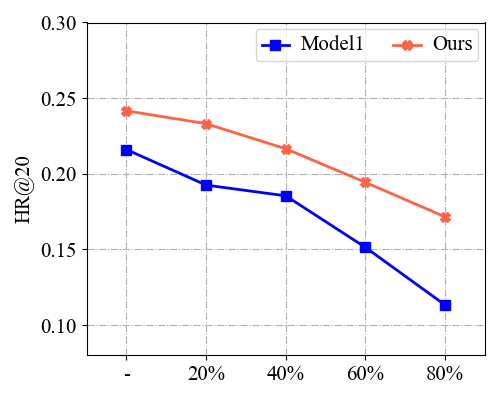

### 柱状图

```
plot_bar()
```
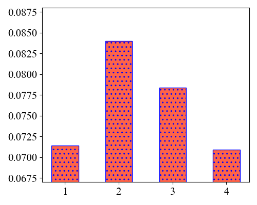

### 多柱状图
多组数据展示利器
```
plot_multi_bar()
```
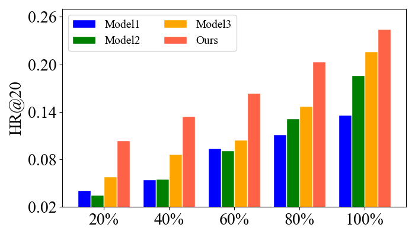

### 多柱状图（有重叠）

```
plot_multi_bar_1()
```

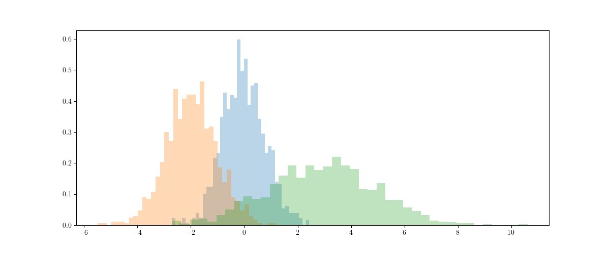

### 柱状+折线

有时单条线或单个柱子太单调了
```
plot_bar_and_line()
```
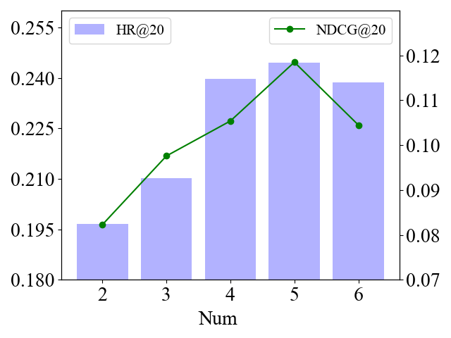

### 2D柱状图

```
plot_2D()
```

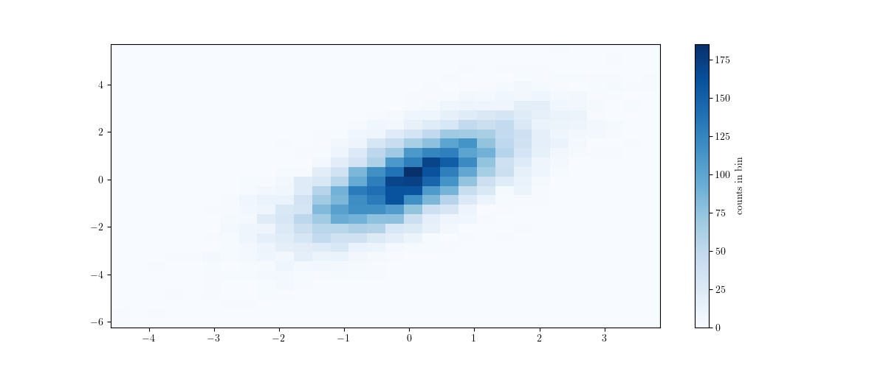

### 折线截断图

```
plt_broken()
```

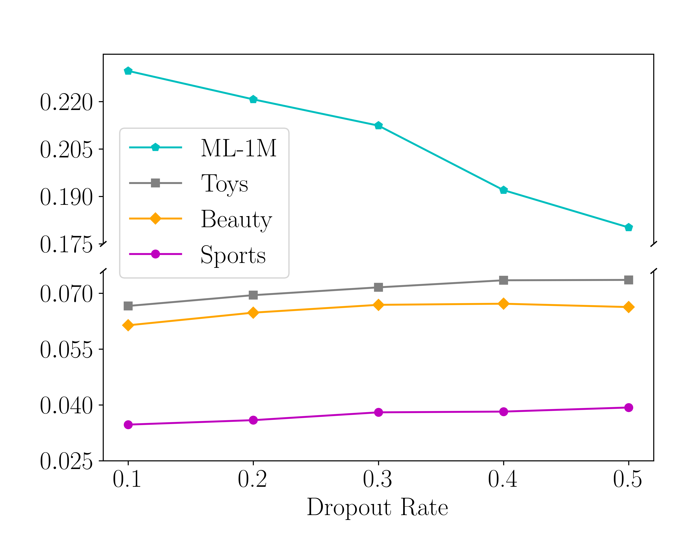

### 柱状截断图

```
bar_broken()
```

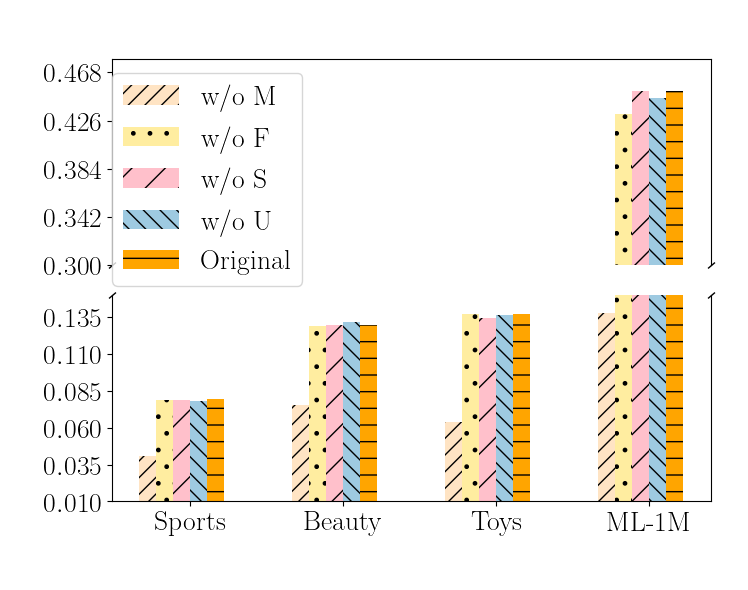

### 散点图

```
plot_scatters()
```
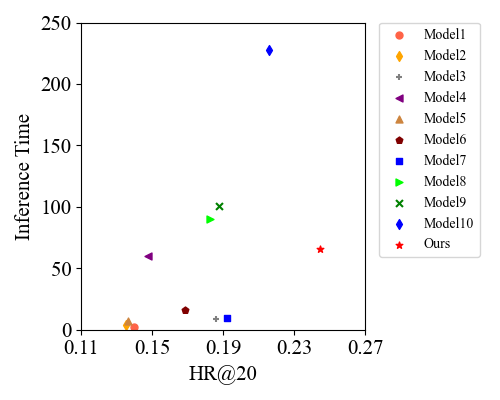

### 箱线图

```
plot_box()
```

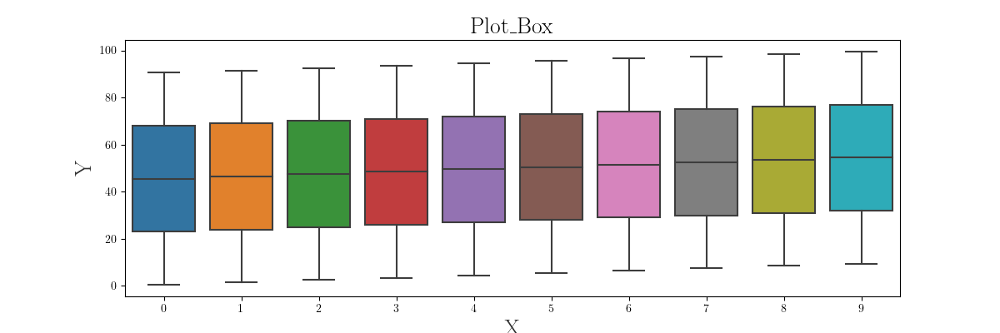

### 小提琴图

```
plot_violin()
```

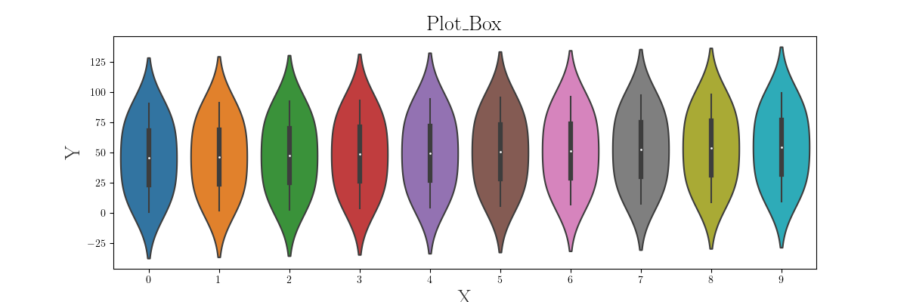

### 热力图

```
plot_hetmap()
```
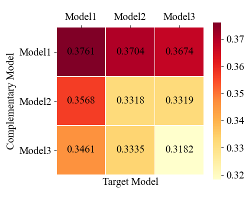

### 3D图像

```
plot_3D()
```

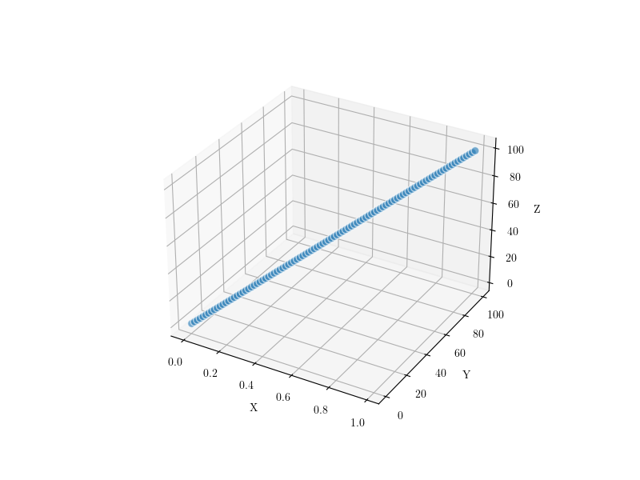

### 组合图1

喜欢用来画多个数据集的ablation,当然也可以画成4个小图在tex里拼装，但可能图之前的缝隙会比较大
```
plot_ablation_bar_in_one()
```
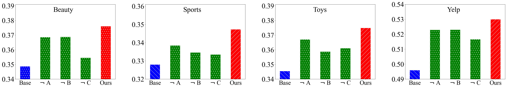

### 组合图2

双坐标轴折线组合图，可以更加直观的观察四个组合图在两个不同指标上的变化趋势

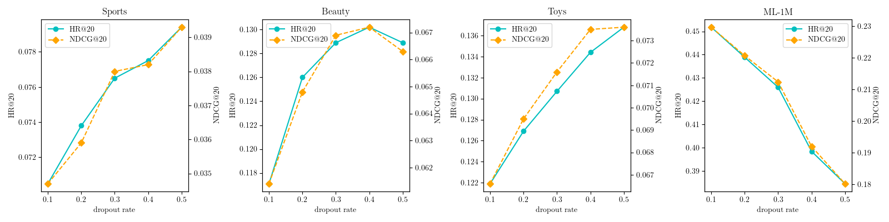

### 组合图3

可以用在验证某方法具有泛化性，然后所有模型试一遍。难点在于一个字图省掉横坐标，且上下对齐。（其实我也不知道这样有啥好，嘻嘻）
```
plot_two_bar_in_one()
```
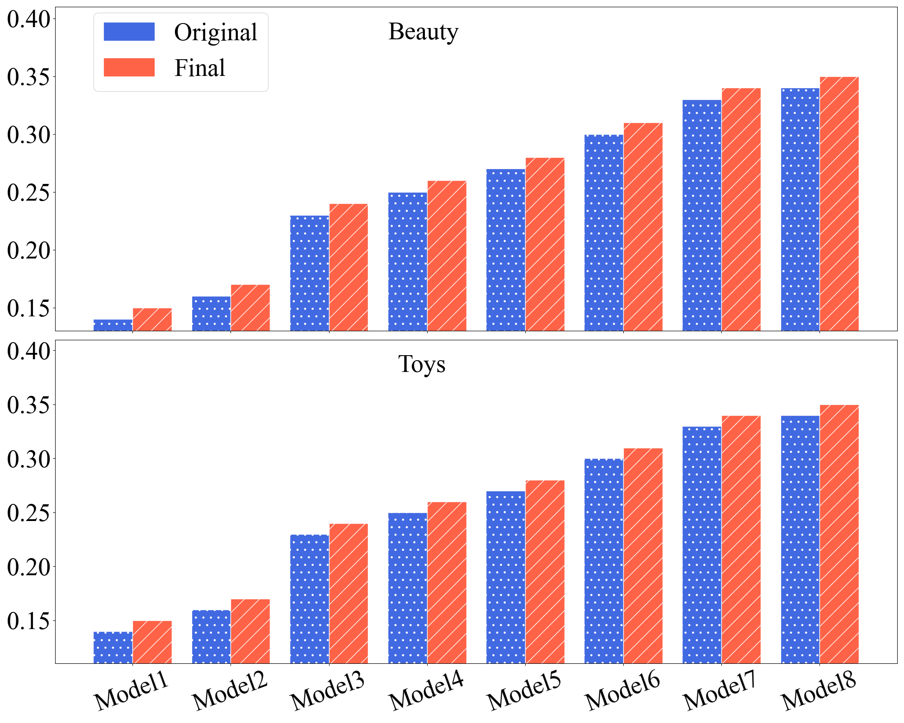

### 使用patchworklib包构建组合图
```
patchworklib_plot.py
```
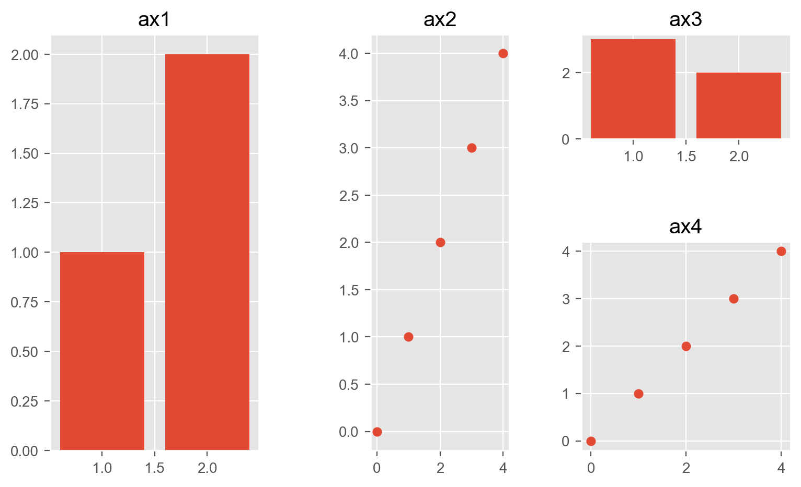
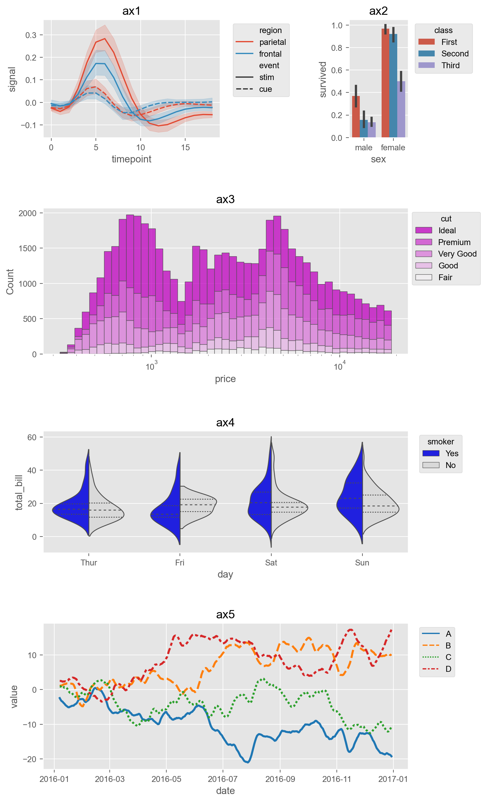
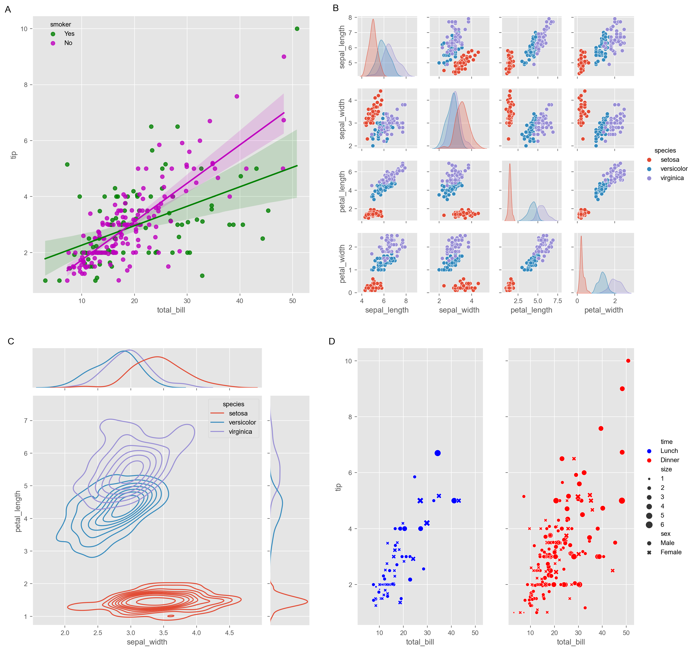
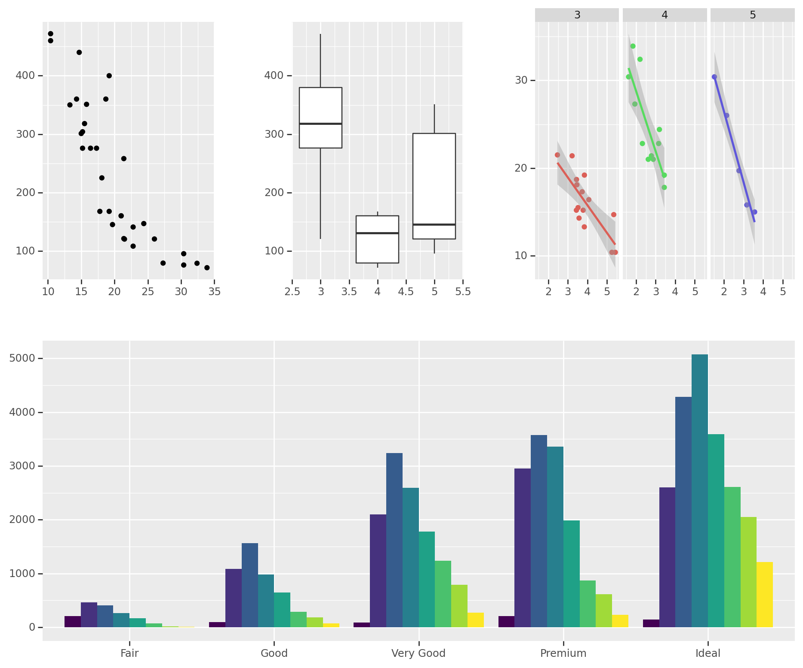
### 向量可视化
t-SNE可视化，提供的例子是一个画embedding随训练变化的例子
```
draw_tsne.py
```
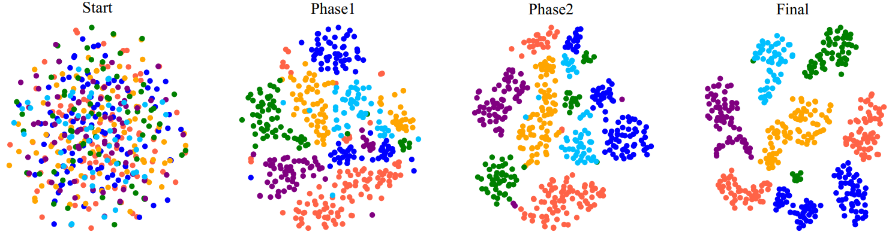

### 快速修改图例参数

```
# 安装包 
pip install pylustrator
# 导入
import pylustrator
# 开启控件
pylustrator.start()
# 注意需要配合使用plt.show()来进行使用
```

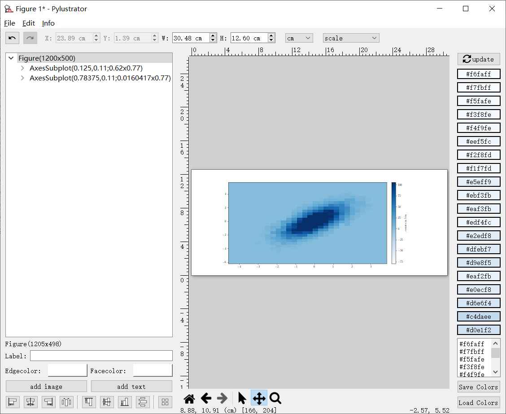

